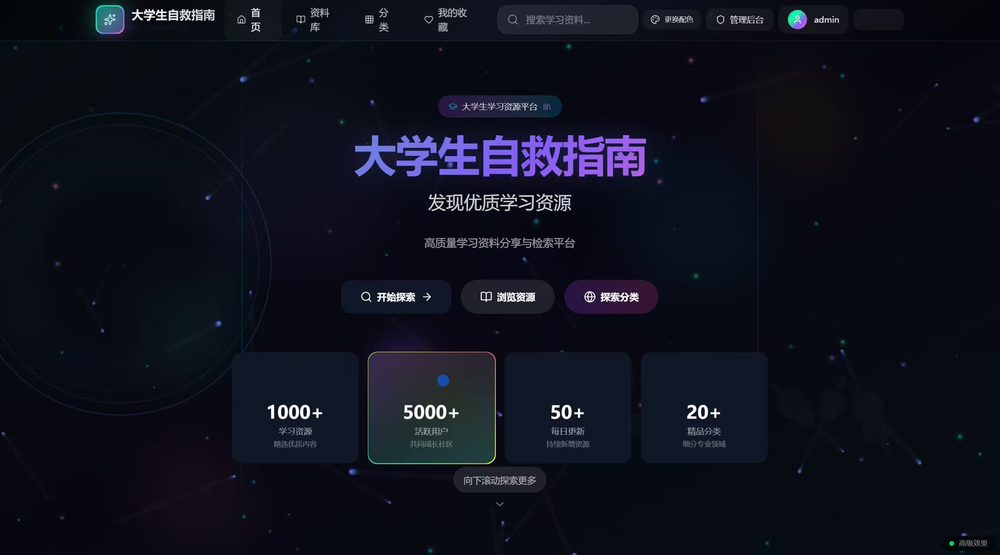
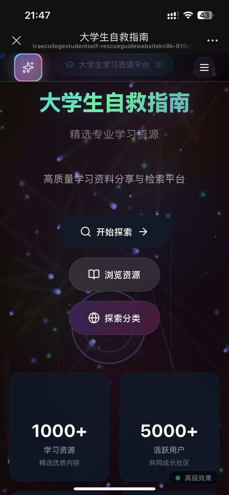
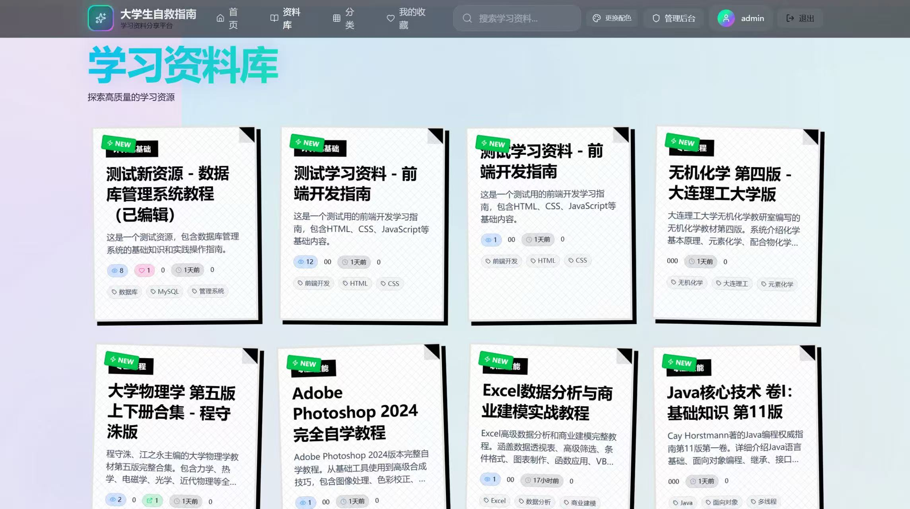
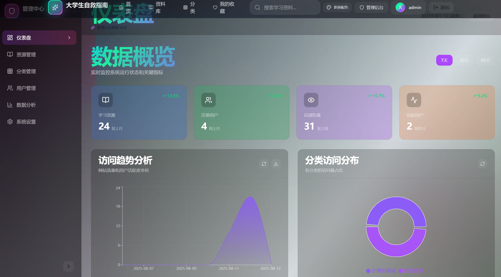

<p align="center">
  
</p>

<p align="center">
  
</p>

<p align="center">
  
</p>

<h1 align="center">大学生自救指南网站</h1>

<p align="center">
  <code>college_student_self-rescue_guide_website</code>
</p>

<p align="center">
  <a href="https://traecollegestudentself-rescueguidewebsitekn9k-615y73x6j.vercel.app" target="_blank">
    
  </a>
  <a href="https://github.com/Marways7/college_student_self-rescue_guide_website" target="_blank">
    
  </a>
  
  
  
  
  
</p>

> [!IMPORTANT]
> 本项目定位为学习资料分享网站搭建示例。当前公开链接仅用于 UI 与交互预览，不是线上真实资料分发平台。

## 项目简介

大学生自救指南网站是一个面向校园学习场景的全栈 Web 项目，聚焦“资料发现、资料管理、后台运营”三类核心需求。
项目主体功能于 **2025 年 8 月** 完成。

- 用户侧：浏览、搜索、筛选、收藏、评分、评论
- 管理侧：资源管理、分类管理、用户管理、系统设置、分析看板
- 工程侧：权限控制、行为统计、基础安全防护、文档化交付

## 在线预览

- 预览地址: `https://traecollegestudentself-rescueguidewebsitekn9k-615y73x6j.vercel.app`
- 说明: 仅用于界面与交互演示，不对应真实线上业务数据。

## 核心亮点

- 前后台一体化架构：同仓覆盖用户产品面和运营管理面。
- RBAC 权限体系：基于 NextAuth + 角色权限控制，保护管理入口。
- 数据闭环能力：资源、分类、收藏、评论、评分、点击/浏览统计打通。
- 可观测性设计：管理端仪表盘与分析接口可用于后续精细化运营。
- 体验导向 UI：桌面端与移动端均有针对性布局和动效组件。

## 功能矩阵

| 模块 | 能力 |
| --- | --- |
| 用户系统 | 注册、登录、会话管理、角色区分（ADMIN/USER） |
| 资源中心 | 资源列表、详情、关键词搜索、分类筛选 |
| 社区互动 | 收藏、评分、评论、浏览与点击统计 |
| 管理后台 | 资源管理、分类管理、用户管理、系统设置 |
| 数据分析 | 仪表盘汇总、趋势图、用户行为数据接口 |
| 开发调试 | `/api/dev/*` 调试接口（生产环境默认返回 403） |

## 技术栈

| 层级 | 技术选型 |
| --- | --- |
| 前端 | Next.js 15 (App Router), React 19, Tailwind CSS 4, Framer Motion |
| 后端 | Next.js Route Handlers, NextAuth, Zod |
| 数据层 | MongoDB, Prisma, MongoDB Native Driver |
| 安全与鉴权 | JWT Session, RBAC, Middleware 基础限流与安全头 |
| 可视化 | Recharts |
| 工程工具 | TypeScript, ESLint, Playwright |

## 界面截图与演示

> 展示素材来自 `UI截图/` 目录。

| 电脑端首页 | 手机端首页 |
| --- | --- |
|  |  |

| 资料库页面 | 管理后台 |
| --- | --- |
|  |  |

- 演示视频: [查看 `UI截图/演示视频.mp4`](./UI截图/演示视频.mp4)

## 快速开始

### 环境要求

- Node.js `>= 20`
- npm `>= 10`
- MongoDB（本地或远程）

### 本地运行

```bash
npm ci
cp .env.example .env
npm run dev
```

访问: `http://localhost:3000`

### 构建与检查

```bash
npm run build
npm run lint
```

## 环境变量

`.env.example` 已提供模板，核心变量如下。

| 变量名 | 必填 | 示例 | 说明 |
| --- | --- | --- | --- |
| `DATABASE_URL` | 是 | `mongodb://127.0.0.1:27017/college_student_self_rescue_guide` | MongoDB 连接串 |
| `NEXTAUTH_URL` | 是 | `http://localhost:3000` | NextAuth 回调基础地址 |
| `NEXTAUTH_SECRET` | 是 | `replace-with-strong-random-string` | 会话签名密钥 |
| `DEV_SEED_ADMIN_EMAIL` | 否 | `admin@example.com` | 本地 seed 管理员邮箱 |
| `DEV_SEED_ADMIN_PASSWORD` | dev seed 场景必填 | `replace-with-strong-dev-password` | 本地 seed 管理员密码 |

## 项目结构

```text
.
├─ src/                  # 业务代码（页面、接口、组件、核心库）
├─ prisma/               # 数据模型定义
├─ public/               # 静态资源
├─ UI截图/               # README 展示素材（截图/视频）
├─ docs/                 # 项目文档（报告、清单、设计等）
├─ Dev-Log.md            # 开发日志
├─ README.md
└─ LICENSE
```

## 文档索引

- 开源前检查清单: [`docs/OPEN_SOURCE_PRE_FLIGHT_CHECKLIST.md`](./docs/OPEN_SOURCE_PRE_FLIGHT_CHECKLIST.md)
- 文档总览: [`docs/README.md`](./docs/README.md)
- 开发日志: [`Dev-Log.md`](./Dev-Log.md)

## 参与贡献

欢迎通过 Issue / PR 参与改进：

- 提交 bug 与复现步骤
- 提交性能优化或安全改进建议
- 提交 UI/交互与可用性提升方案

## 许可证

本项目使用 [MIT License](./LICENSE)。

## Star History

[](https://www.star-history.com/#Marways7/college_student_self-rescue_guide_website&Date)
